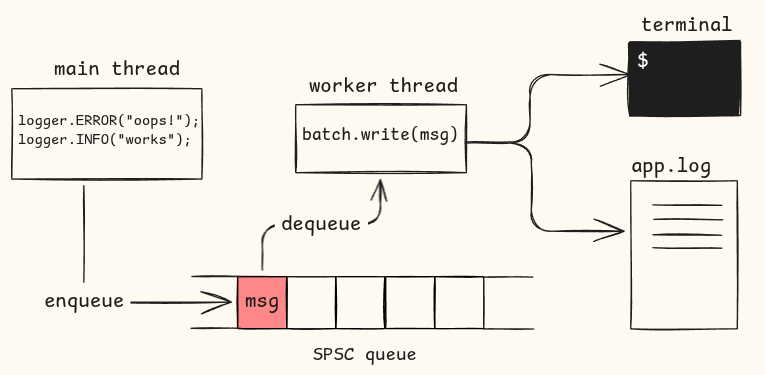

## logX - Async C++ logger
logX is an asynchronous logger library for C++ that writes log messages to a file using a background worker thread.

- Log levels (DEBUG, INFO, WARN, ERROR, NONE)
- Configurable output targets (file, terminal)
- Single-producer single-consumer lock-free queue
<br>



## ⚡ Quick Start
(Refer `example/example.cpp`)
```cpp
#include <logX/logger.h>

int main() {
    Logger logger("logger.conf");

    logger.INFO("Application started");
    logger.ERROR("Something went wrong!");
}
```
1. Add a `logger.conf` file in project directory.
2. Build and run (see below).
3. Logs appear in console and/or app.log(default file if not specified).


## 📦 Building & Running:
Run the helper script
```bash
./build_and_test.sh
```
This will:
1. Configure & build the library and example app
2. Run all tests using `ctest`.

The example binary will be available in:
```bash
./build/example
```
Check the generated log file (e.g. `app.log`) to see the output.

## ⚙️ Configuration:
Logging behaviour is configured via `logger.conf`:
```ini
[logger]
level = INFO        # Possible values: DEBUG, INFO, WARN, ERROR, NONE
queue_size = 1024   # queue size

[hooks]
file = app.log      # File path for file hook
console = true      # Print logs to console
```
- `level` = minimum level to record
- `queue_size` = size of internal message queue
- `file` = optional output file
- `console` = print logs to console if true


## ✅ Running Tests:
logX uses [Googletest (Gtest)](https://github.com/google/googletest), automatically fetched using cmake
1. Run with helper script:
```bash
./build_and_test.sh
```
This will automatically build and run the test suite for you.

2. Or run manually:
```bash
cd build && ctest --output-on-failure
```

### 📌 Notes: 
API is still under development.<br>
Contributions & feedback are welcome.